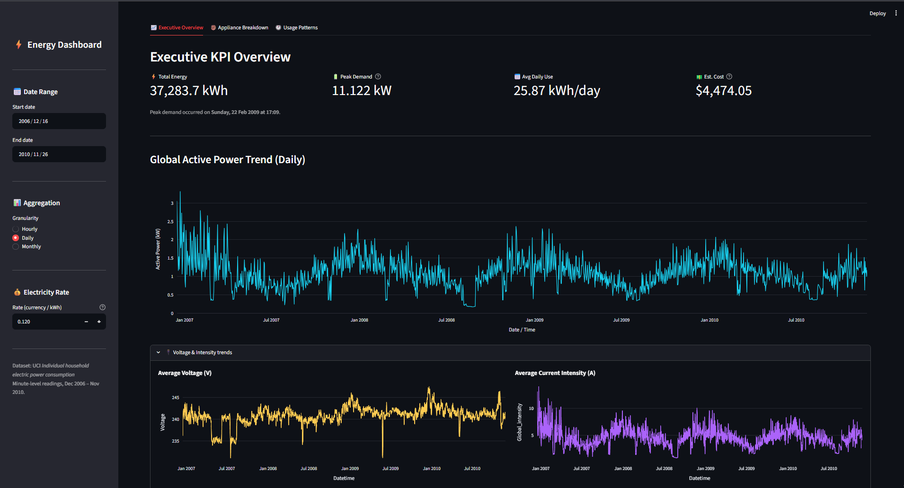
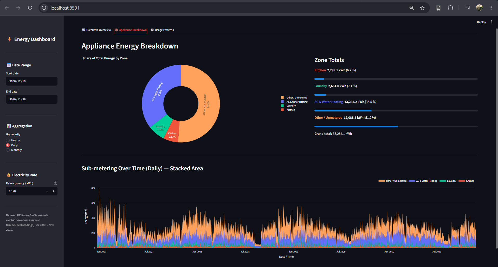
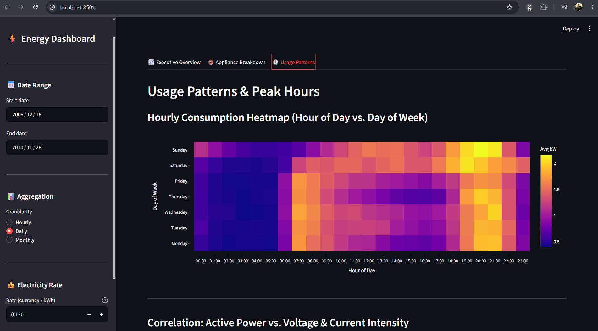
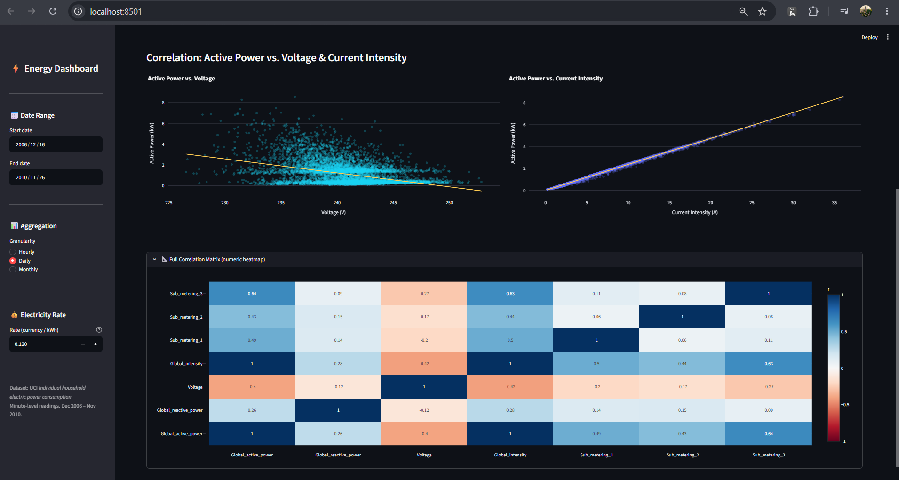

# ⚡ Household Energy Consumption Analytics Dashboard

An interactive, browser-based analytics dashboard for exploring **4 years of minute-level household electricity data**. Built with **Streamlit**, **Pandas**, and **Plotly** 

---

## 📸 Some Images


| Executive Overview | Appliance Breakdown |
|---|---|
|  |  |

| Usage Patterns & Heatmap | Correlation Scatter |
|---|---|
|  |  |

---

## 🚀 Quick Start

### 1 · Clone / Download

```bash
git clone github.com/mohdsahil00736/Household-Energy-Consumption.git
cd energy-consumption-dashboard
```

### 2 · Create & activate a virtual environment

```bash
# Windows
python -m venv .venv
.\.venv\Scripts\Activate.ps1

# macOS / Linux
python -m venv .venv
source .venv/bin/activate
```

### 3 · Install dependencies

```bash
pip install -r requirements.txt
```

### 4 · Add the dataset

Download **`household_power_consumption.txt`** from the [UCI Machine Learning Repository](https://archive.ics.uci.edu/ml/datasets/Individual+household+electric+power+consumption) and place it in the **project root** (same folder as `app.py`).

```
Energy Consumption prediction/
├── app.py
├── household_power_consumption.txt   ← here
└── ...
```

### 5 · Launch the app

```bash
streamlit run app.py
```

Streamlit will open your browser automatically at **`http://localhost:8501`**.

---

## 📁 Project Structure

```
Energy Consumption prediction/
│
├── app.py                              # Main Streamlit application
├── household_power_consumption.txt     # Raw dataset (UCI, ~500 MB, not committed)
├── requirements.txt                    # Python dependencies
├── README.md                           # This file
│
└── assets/                             # Screenshots for README (create manually)
    ├── screenshot_tab1.png
    ├── screenshot_tab2.png
    ├── screenshot_tab3_heatmap.png
    └── screenshot_tab3_scatter.png
```

---

## 🗂️ Dataset

| Property | Detail |
|---|---|
| **Source** | [UCI ML Repository](https://archive.ics.uci.edu/ml/datasets/Individual+household+electric+power+consumption) |
| **Coverage** | December 2006 – November 2010 (~4 years) |
| **Granularity** | 1-minute intervals |
| **Size** | ~2 million rows, ~500 MB |
| **Separator** | Semicolon (`;`) |
| **Missing values** | Encoded as `?` |

### Columns

| Column | Unit | Description |
|---|---|---|
| `Date` | — | Day/Month/Year |
| `Time` | — | hh:mm:ss |
| `Global_active_power` | kW | Total active power consumed by the household |
| `Global_reactive_power` | kW | Total reactive power |
| `Voltage` | V | Average voltage |
| `Global_intensity` | A | Average current intensity |
| `Sub_metering_1` | Wh | Kitchen (dishwasher, oven, microwave) |
| `Sub_metering_2` | Wh | Laundry (washing machine, dryer, fridge) |
| `Sub_metering_3` | Wh | Climate (electric water heater, AC) |

> A derived column **`Sub_metering_remainder`** is computed at load time to capture unmonitored energy:
> ```
> Sub_metering_remainder = (Global_active_power × 1000 / 60) − SM1 − SM2 − SM3
> ```

---

## 🏗️ How It Works

### Data Pipeline

```
household_power_consumption.txt
        │
        ▼
  load_data()  ──  @st.cache_data (runs once per session)
        │
        ├─ Parse Date + Time → DatetimeIndex
        ├─ Cast all numeric columns to float32
        ├─ Drop rows with missing Global_active_power
        └─ Compute Sub_metering_remainder
        │
        ▼
  raw_df  (full ~2 M rows in memory)
        │
  Sidebar filters (date range)
        │
        ▼
  filtered_df  →  resample_df()  →  resampled_df
                                      (Hourly / Daily / Monthly)
```

### Sidebar Controls

| Control | Effect |
|---|---|
| **Date Range** | Slices `raw_df` to the chosen start–end window |
| **Granularity** | Resamples to Hourly (`h`), Daily (`D`), or Monthly (`ME`) |
| **Electricity Rate** | Currency per kWh used to compute estimated cost KPI |

---

## 📊 Dashboard Tabs

### Tab 1 · 📈 Executive Overview

| Component | Description |
|---|---|
| **4 KPI cards** | Total energy (kWh), Peak demand (kW) with timestamp, Avg daily use (kWh/day), Estimated cost |
| **Active Power Trend** | Line chart of `Global_active_power` at selected granularity |
| **Voltage & Intensity** | Expandable section with side-by-side line charts for voltage and current |

### Tab 2 · 🍩 Appliance Breakdown

| Component | Description |
|---|---|
| **Donut chart** | Share of total energy split across Kitchen, Laundry, AC & Water Heating, Other/Unmetered |
| **Zone Totals panel** | Coloured labels, kWh totals, percentage, and progress bars for each zone |
| **Stacked Area chart** | All four sub-metering streams stacked over time at selected granularity |

### Tab 3 · 🕐 Usage Patterns

| Component | Description |
|---|---|
| **Heatmap** | Average power consumption by Hour of Day (x) × Day of Week (y) — reveals peak usage windows |
| **Scatter: Power vs Voltage** | 8,000-point sample with OLS trendline |
| **Scatter: Power vs Intensity** | 8,000-point sample with OLS trendline |
| **Correlation Matrix** | Expandable full numeric heatmap (Pearson r) across all 7 measurement columns |

---

## 📦 Dependencies

| Package | Version | Purpose |
|---|---|---|
| `streamlit` | ≥ 1.35 | Web UI framework |
| `pandas` | ≥ 2.0 | Data loading, resampling, aggregation |
| `plotly` | ≥ 5.20 | Interactive charts |
| `numpy` | ≥ 1.26 | Numerical operations |
| `scipy` | ≥ 1.11 | Required by statsmodels |
| `statsmodels` | ≥ 0.14 | OLS trendlines in Plotly Express scatter |

Install all at once:

```bash
pip install -r requirements.txt
```

---

## ⚙️ Performance Notes

- **`@st.cache_data`** — the dataset is loaded and parsed only once per Streamlit session; subsequent reruns (e.g. changing sidebar filters) reuse the cached `raw_df`.
- **`float32` dtypes** — halves memory usage versus the default `float64` for all numeric columns (~250 MB vs ~500 MB).
- **Scatter sampling** — scatter plots use a random sample of 8,000 points to keep rendering fast while preserving the visual distribution.
- **Correlation matrix sampling** — capped at 50,000 rows for the Pearson correlation computation.

---

## 🛠️ Troubleshooting

| Error | Fix |
|---|---|
| `FileNotFoundError: household_power_consumption.txt` | Download the dataset from UCI and place it in the project root |
| `ModuleNotFoundError: No module named 'statsmodels'` | Run `pip install statsmodels` |
| Blank page / spinner stuck | The ~500 MB file takes 10–30 s to load on first run — wait for the spinner to clear |
| `start_date > end_date` error | Adjust the sidebar date inputs so start is before end |

---

## 📄 License

This project is released under the [MIT License](LICENSE).  
Dataset: [UCI Machine Learning Repository](https://archive.ics.uci.edu/ml/datasets/Individual+household+electric+power+consumption) — Georges Hébrail & Alice Bérard.
